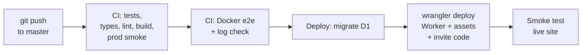

# Deploying Lớp Học Hạnh Phúc

The runbook for putting the app online, operating it and rolling back. A push to `master` is the whole deploy, GitHub Actions tests and ships it to one Cloudflare Worker that serves the
pages and the API, and everything runs on free tiers. The only cost is the domain.

Section 2 records the one-time setup that `setup/setup.sh` performs.

## Contents

1. [At a glance](#at-a-glance)
2. [First deploy (one time)](#first-deploy-one-time)
3. [Everyday deploys](#everyday-deploys)
4. [Configuration reference](#configuration-reference)
5. [Accounts and support](#accounts-and-support)
6. [Database and backups](#database-and-backups)
7. [Rolling back](#rolling-back)
8. [Logs, limits and cost](#logs-limits-and-cost)
9. [Before you push](#before-you-push)
10. [Troubleshooting](#troubleshooting)

---

## At a glance

| Piece | Where it runs | Name |
| --- | --- | --- |
| Code, CI/CD | GitHub, the teacher's own private repo | See `TEACHER.md`, branch `master` |
| Pages (10 static routes) and API (`/api/*`) | One Cloudflare Worker with static assets | Worker `lop-hoc-hanh-phuc` |
| Database | Cloudflare D1 (SQLite) | `lop-hoc-hanh-phuc` |
| Photos (avatars, class covers) | Inside D1, resized in the browser first | table `images` |
| Cloudflare account | The teacher's own, Free plan | Account id in the `CLOUDFLARE_ACCOUNT_ID` secret |
| Live URL | workers.dev first, her domain once she buys one | See `TEACHER.md` |
| The laptop | Windows + WSL Ubuntu, always on | Runs `claude remote-control` for her phone |



If any box fails, the ones after it don't run and the live site stays on the previous version.

---

## First deploy (one time)

**`setup/setup.sh` does all of this** and is safe to run again: every step checks whether it is already done. The
teacher's side of it, in Vietnamese, is `setup/HUONG-DAN-CAI-DAT.md`. What it does, so it can be repaired by hand:

1. **Tools**: git, Docker Engine (inside WSL, no Docker Desktop), Node 22 through nvm, the GitHub CLI, Claude Code.
2. **GitHub**: `gh auth login --web --scopes workflow` (the scope lets Claude push changes to `.github/workflows`),
   then creates her private repo from the template (`gh repo create <name> --private --template <template>`), or from
   the folder it was run in, and clones it to `~/lop-hoc`.
3. **`TEACHER.md`**: her name, class and school, from three questions.
4. **Cloudflare**: `npx wrangler login` for Claude's own use on the laptop (logs, backups), and a CI token created
   from a prefilled link (Workers Scripts, Workers Routes, D1, Zone, DNS and Zone Settings: Edit; Account Settings:
   Read). The token is pasted into a hidden prompt, checked against `/user/tokens/verify`, stored as the
   `CLOUDFLARE_API_TOKEN` secret and in `~/.lop-hoc/cloudflare-token` (mode 600) for `setup/domain.sh`.
5. **Account, database and address**: the account id (`CLOUDFLARE_ACCOUNT_ID`), the D1 database created in APAC
   (`D1_DATABASE_ID`), the account's workers.dev subdomain (registered if the account has none), and
   `SITE_URL=https://lop-hoc-hanh-phuc.<subdomain>.workers.dev`.
6. **Invite code**: generated with `openssl rand`, set as `TEACHER_INVITE_CODE`, kept in `~/.lop-hoc/ma-moi.txt`.
7. **First deploy**: commits `TEACHER.md`, pushes, watches CI to the end, then registers her teacher account through
   `/api/auth/teacher/register` with the username and password she typed.
8. **The laptop**: a `lophoc` command, and a Windows Startup entry that runs `claude remote-control
   --permission-mode bypassPermissions` in `~/lop-hoc` inside tmux, so the phone finds the laptop again after a restart.

**Her own domain** (optional, any time later): `bash setup/domain.sh <name>` adds the zone to Cloudflare, prints the two
nameservers she types at the registrar, waits for the zone to turn Active, deletes the registrar's parked records,
turns on Always Use HTTPS, sets `CUSTOM_DOMAIN` and `SITE_URL`, and redeploys. The workers.dev address keeps working.

---

## Everyday deploys

1. Work on a branch; run the local loop ([Before you push](#before-you-push)).
2. Merge or push to `master`. CI runs the tests, the Docker e2e suite and the log check, then deploys.
3. Watch it: `gh run watch`. When it's green the change is live.

Redeploy without a code change (after rotating a secret or changing a Variable): `gh workflow run deploy.yml --ref master`.

The repo is private on GitHub's free plan: 2,000 Actions minutes a month; a push to `master` uses about 10. Pushes that
only touch Markdown or `docs/` skip CI.

---

## Configuration reference

GitHub → repo **Settings → Secrets and variables → Actions**. Every change needs a redeploy.

**Variables**

| Name | Value | Used for |
| --- | --- | --- |
| `D1_DATABASE_ID` | ID of the `lop-hoc-hanh-phuc` database | Which database the Worker binds |
| `CUSTOM_DOMAIN` | the domain, e.g. `lophochanhphuc.online` | Attaches the domain to the Worker; `SITE_URL` follows it |
| `SITE_URL` | only while there's no domain: the workers.dev address | Secure cookies, same-origin checks |

**Secrets**

| Name | Comes from | Used for |
| --- | --- | --- |
| `CLOUDFLARE_API_TOKEN` | Cloudflare → My Profile → API Tokens (setup step 4) | Every wrangler command in the deploy |
| `CLOUDFLARE_ACCOUNT_ID` | Workers & Pages overview | Which account to deploy to |
| `TEACHER_INVITE_CODE` | `openssl rand` (setup step 6) | Registering a teacher account. Unset means nobody can register |

What the deploy writes into the production Worker config (`scripts/prod-config.mjs`): the D1 id, the static assets with
`run_worker_first: ["/api/*"]` (pages never run the Worker), `ENVIRONMENT=production`, `SITE_URL`, the custom domain and
a sign-in limit of 30 attempts per IP per minute. The local config keeps 1,000 so e2e runs never trip it.

---

## Accounts and support

| Situation | What to do |
| --- | --- |
| A child forgot the password | The teacher: Học sinh → "Hiện mật khẩu" reads it back, or the key icon → "Đặt lại mật khẩu" hands out a new code and signs the old devices out |
| A child is locked out ("Nhập sai nhiều lần quá") | Eight wrong passwords lock the account for 10 minutes (counted atomically, so guesses sent all at once don't get more tries). The teacher's reset unlocks it at once |
| A colleague wants an account on this copy | Give her the invite code (`~/.lop-hoc/ma-moi.txt`); she registers at `/giao-vien/dang-ky/` |
| A teacher forgot her password | There's no email reset. `node scripts/hash-password.mjs` (type the new password; it isn't shown) and run the SQL below with the printed hash. Tell her the new password in person, then she changes it in the app |
| The invite code leaked | `rm ~/.lop-hoc/ma-moi.txt && bash setup/setup.sh --new-invite-code`. Existing accounts are unaffected |
| A teacher is locked out again and again | Someone knows her username and is guessing. The lock lifts after 10 minutes. To take the username out of reach, rename it in D1: `UPDATE teachers SET username = '<new>' WHERE username = '<old>'` (same command shape as the password reset above) |

```bash
D1_DATABASE_ID=<id> SITE_URL=https://<domain> node scripts/prod-config.mjs
cd apps/api && npx wrangler d1 execute lop-hoc-hanh-phuc --remote -c wrangler.production.jsonc \
  --command "UPDATE teachers SET password_hash = '<hash>', failed_logins = 0, locked_until = NULL WHERE username = '<username>'"
```

---

## Database and backups

Everything in D1 is data that can't be recreated: children's names, drops, answers, remarks, messages and photos.

`migrations/0001_init.sql` is the start of the schema and the later files add to it. **Everything is additive**:
squashing or rewriting an applied migration would mean throwing away a real class.

**Add a migration**

1. `cd apps/api && npx wrangler d1 migrations create lop-hoc-hanh-phuc <short_name>` → `migrations/0002_<short_name>.sql`.
2. Write it additively (new tables, new columns with a default). The deploy runs migrations before the new code goes
   out, so for a moment the old code runs on the new schema.
3. `npm test` applies every migration to a fresh database; `npm run stack:up` applies it locally; run `npm run e2e`.

**Backups**

| Need | How |
| --- | --- |
| Undo a mistake from the last 7 days | D1 Time Travel (7 days on the free plan): `npx wrangler d1 time-travel info lop-hoc-hanh-phuc --timestamp=<ISO time> -c wrangler.production.jsonc`, then the same with `restore`. **A restore rewinds the whole database**, including everything since |
| A copy to keep | Monthly, and before any risky migration: `npx wrangler d1 export lop-hoc-hanh-phuc --remote -c wrangler.production.jsonc --output=lhhp-$(date +%F).sql`. Keep it out of the repo and off shared drives: it holds children's data |
| The teacher wants her records | Báo cáo → "Tải file Excel (CSV)" per week, month or semester |

**Look at the data**: Cloudflare → Storage & databases → D1 → `lop-hoc-hanh-phuc` → Console. Stick to `SELECT`.

---

## Rolling back

1. **Put the last good version back** (about a minute): Workers & Pages → `lop-hoc-hanh-phuc` → Deployments → the
   previous version → Rollback. Or `cd apps/api && npx wrangler rollback -c wrangler.production.jsonc`.
2. **Fix `master`** so the next push doesn't ship the bad code again: `git revert <sha> && git push`.
3. **Data**: a Worker rollback doesn't undo migrations or writes. Use Time Travel if data was damaged.

Take the app offline: Workers & Pages → `lop-hoc-hanh-phuc` → Settings → Domains & Routes → remove the domain.

---

## Logs, limits and cost

| What | Where |
| --- | --- |
| Is it up? | `https://<domain>/api/health` → `{"ok":true,"db":"ok","environment":"production"}` |
| Worker logs | Workers & Pages → `lop-hoc-hanh-phuc` → Observability / Logs. One JSON line per request with `reqId`; every response carries `x-request-id` |
| Live stream | `cd apps/api && npx wrangler tail lop-hoc-hanh-phuc --format pretty` |
| Failed deploys | GitHub emails the repo owner |

Events worth searching for: `login_failed`, `login_locked`, `rate_limited`, `invite_code_rejected`,
`teacher_registered`, `students_added`, `student_password_reset`, `unhandled_error` (with a stack trace).

**Free-tier limits.** A class of 35 families is a small fraction of each.

| Service | Free limit | At the limit |
| --- | --- | --- |
| Workers | 100,000 requests a day; 10 ms CPU per request | `/api/*` fails until 00:00 UTC (07:00 in Vietnam). Pages still load |
| D1 | 5 million rows read and 100,000 written a day; 500 MB per database | Queries fail until 00:00 UTC |
| GitHub Actions (private repo) | 2,000 minutes a month | Workflows stop until next month |

Password hashing is the one CPU-heavy step: PBKDF2 with 30,000 rounds, about 2 ms per hash on a laptop, inside the
10 ms budget even when a password change hashes twice. On the paid Workers plan ($5 a month, 30 s of CPU) raise
`PBKDF2_ITERATIONS` in `apps/api/src/lib/password.ts`; existing passwords keep working because each hash stores its
own round count.

Photos: an avatar is at most 120 KB and a cover 450 KB, resized in the browser. 35 avatars and a cover are under 5 MB.

Tệp hồ sơ (Word, Excel, PDF on a child's Măng non page; taken off the page on 24/09, API and table kept) are the one thing that can grow the database fast, so they are
capped: 5 MB a file, 10 a child, **100 MB a class** (`MAX_FILE_BYTES_PER_CLASS`), stored as base64 in D1 against the
500 MB free limit. They arrive as raw bytes and are encoded with the runtime's native base64, which keeps a 5 MB file
inside the 10 ms CPU budget; a JSON body that size would not be.

**Cost**: the domain only. Workers, D1, GitHub Actions and the certificate are free.

---

## Before you push

| Command | What it proves |
| --- | --- |
| `npm test` | 179 tests: shared domain rules, the API on workerd with a real D1, web components, scripts |
| `npm run typecheck`, `npm run lint` | Types (including the generated Worker types) and lint |
| `npm run stack:up && npm run e2e && npm run logs:check` | The Docker stack, 20 Playwright specs, clean logs |
| `npm run build:web && npm run smoke:prod` | The exact production Worker config served locally: 22 checks |

---

## Troubleshooting

| Symptom | Cause | Fix |
| --- | --- | --- |
| Deploy says **Deploy skipped** | A Cloudflare secret, `D1_DATABASE_ID`, or both `SITE_URL` and `CUSTOM_DOMAIN` are missing | Run `bash setup/setup.sh` on the laptop |
| Signing in works but every page asks to sign in again | The site is served over http, or `SITE_URL` names another address: the Secure cookie is dropped | Serve over https; set `SITE_URL`/`CUSTOM_DOMAIN` to the address people use |
| Teacher registration says "Mã mời chưa đúng." | Wrong code, or `TEACHER_INVITE_CODE` was never set | Set the secret, redeploy |
| "Thử nhiều lần quá. Đợi một phút rồi thử lại nhé." | More than 30 sign-ins from one IP in a minute (a whole class on the school wifi at once) | Wait a minute. The limit is in `scripts/prod-config.mjs` |
| A family says the username doesn't work | Usernames are unique across the app; a second "An" gets `AnNV2026` | Check the exact username in Học sinh or on the printed slip |
| Local `npm run e2e` fails on a spec you just changed | The e2e image holds the old specs | `docker compose --profile test build e2e` |
| Local stack shows no sample class | The volume already had data | `npm run stack:reset && npm run stack:up` |
| CI typecheck: "Types at worker-configuration.d.ts are out of date" | `wrangler.jsonc` changed | `npm run types -w @lhhp/api`, commit the file |
